# 클럽 배드민턴 리그 — 스크린샷 (모던 테마)

앱: 클럽 시범 리그 (`club-league.bau8584.workers.dev`) · 데모 데이터(가짜 닉네임) · 뷰포트 1440x900

| 파일 | 설명 | 미리보기 |
|------|------|----------|
| `10-tier.png` | 티어 순위표 — 순위·급·닉네임·티어·RP·최근5경기·승률 (히어로) | 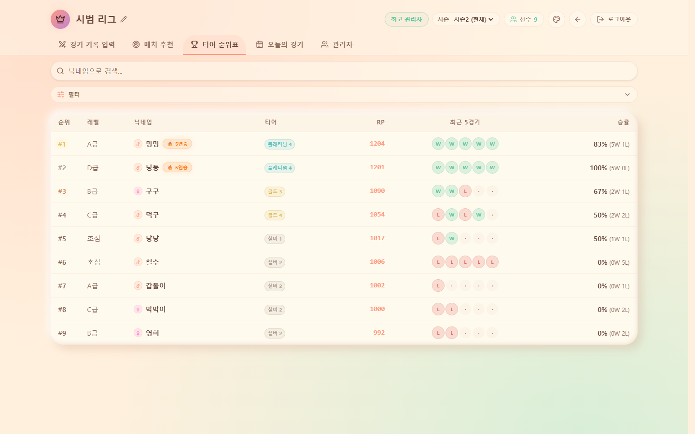 |
| `11-record.png` | 경기 기록 입력 — 복식 2:2 스코어보드 | 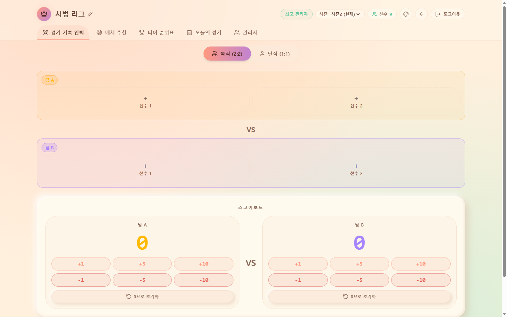 |
| `12-match.png` | 매치 추천 — 선수 선택 후 AI 파트너/라이벌 추천 | 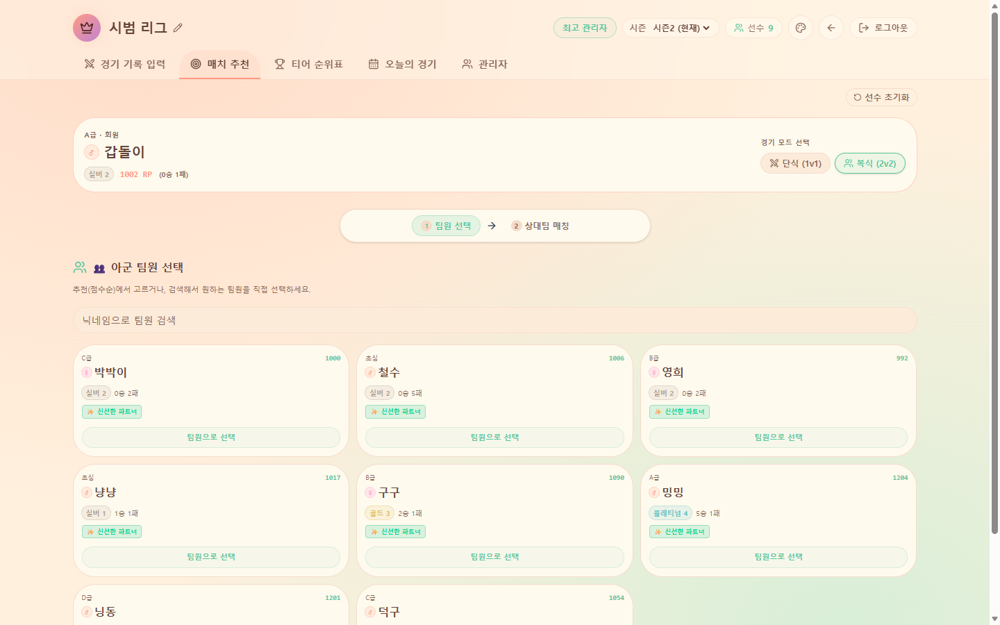 |
| `13-today.png` | 오늘의 경기 — 요약 카드 (해당 날짜 경기 없음) | 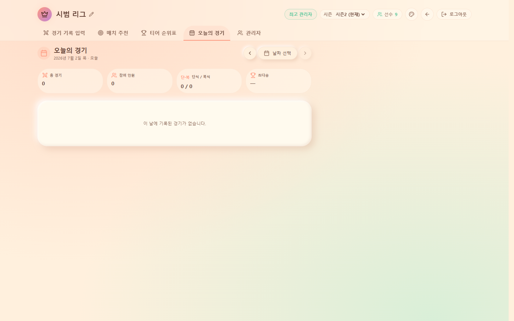 |
| `20-admin-global.png` | 관리자 → 리그 글로벌 설정 (경기 입력 방식·리그 이름) | 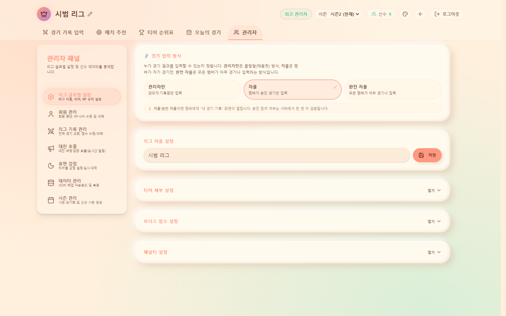 |
| `21-member.png` | 관리자 → 회원 관리 (닉네임·레벨·나이·성별·티어·RP 수정) | 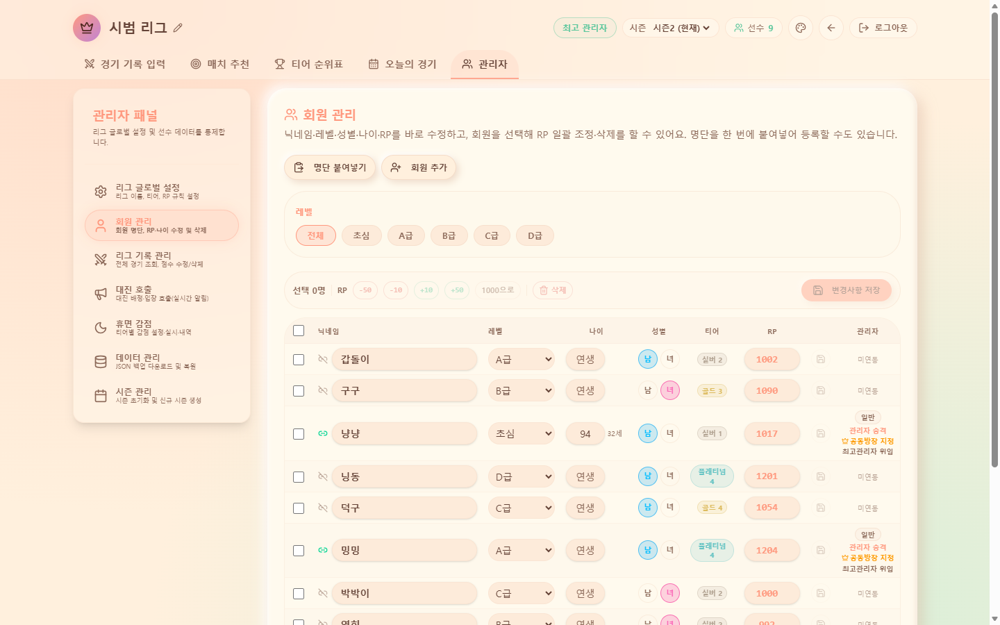 |
| `22-dormancy.png` | 관리자 → 휴면 감점 (티어별 감점 설정·실시) | 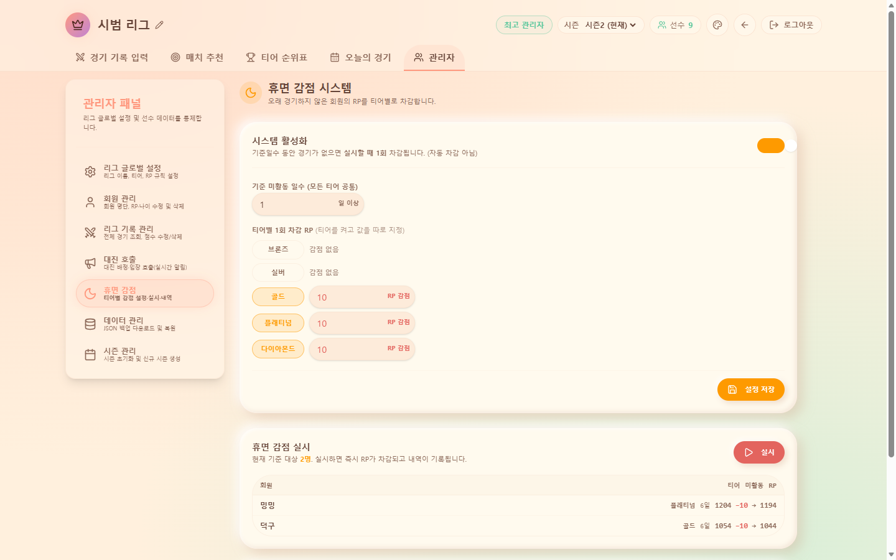 |
| `23-season.png` | 관리자 → 시즌 관리 (시즌2·새 시즌 시작) | 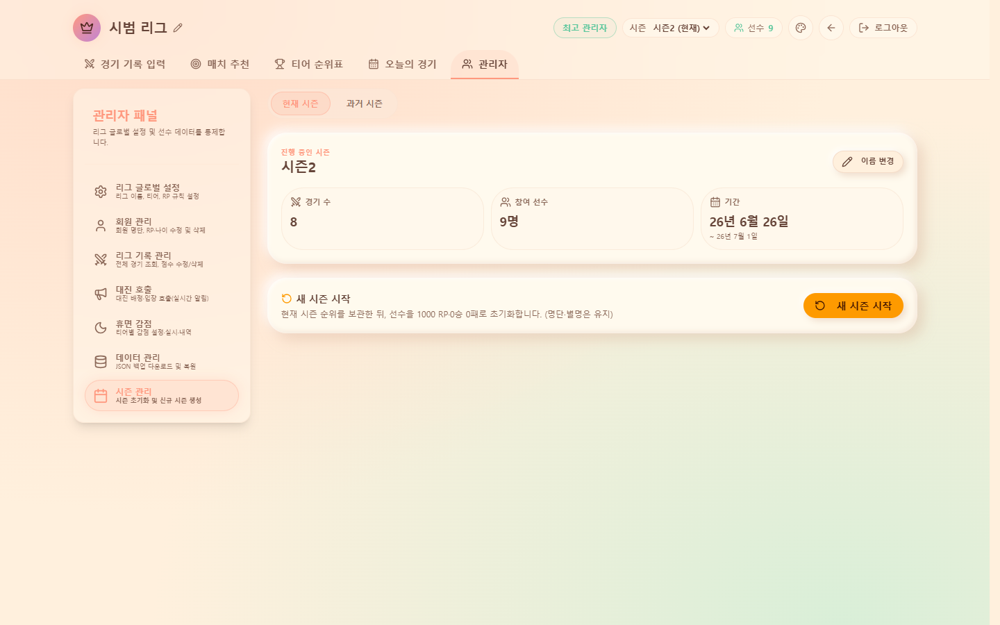 |
| `24-backup.png` | 관리자 → 데이터 관리 (JSON 백업/복원) | 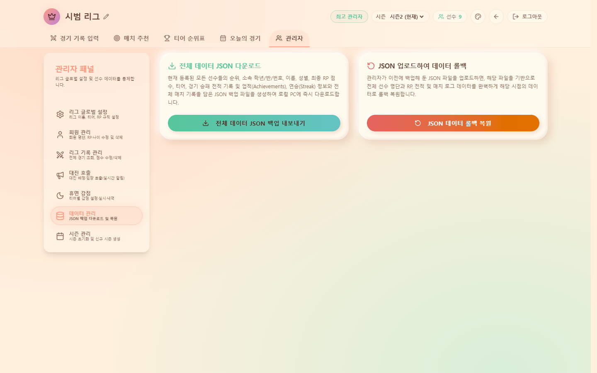 |
| `25-bonus.png` | 글로벌 설정 → 보너스 점수 설정 펼침 | 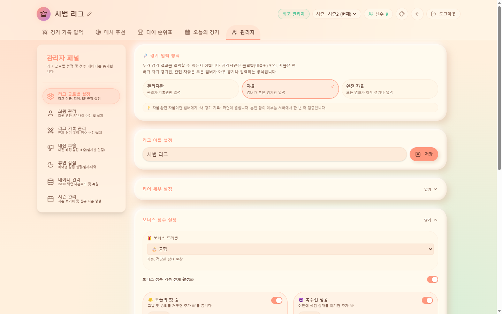 |
| `26-penalty.png` | 글로벌 설정 → 페널티 설정 펼침 | 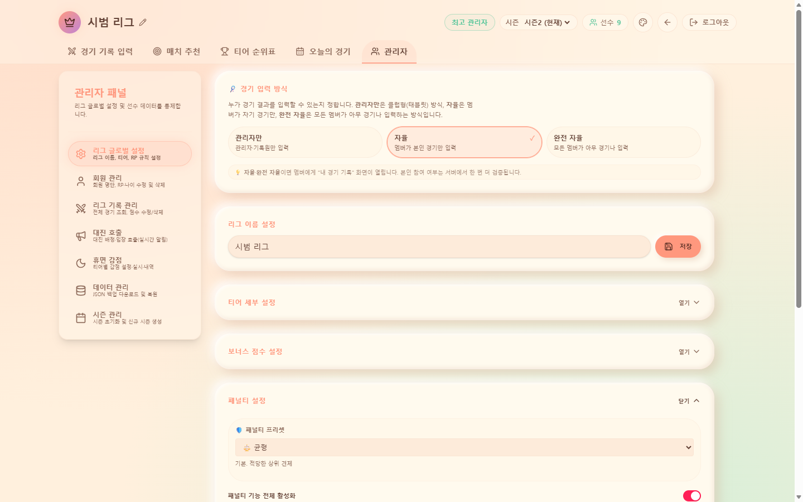 |
| `27-tier-settings.png` | 글로벌 설정 → 티어 세부 설정 펼침 | 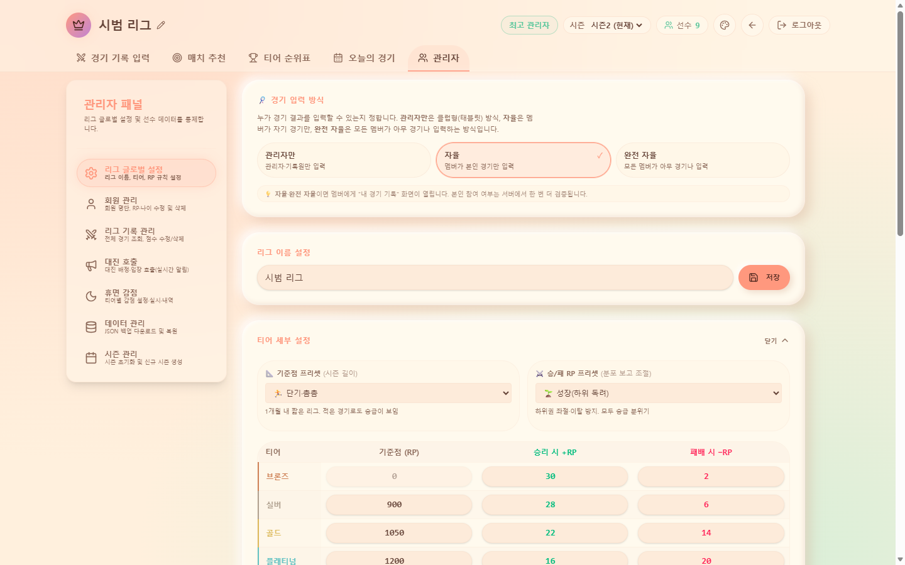 |
| `theme-picker.png` | 상단 🎨 화면 테마 팝오버 (게임·블랙·모던·클레이) | 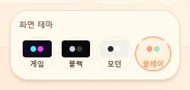 |
